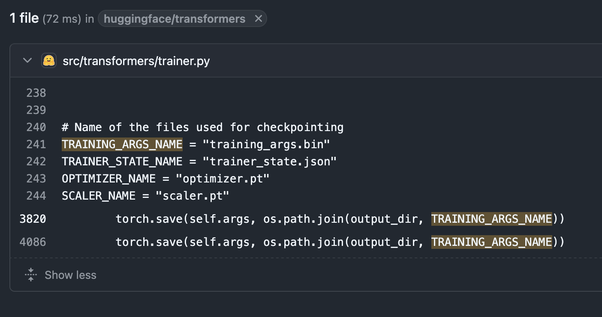

**Scope** can be simply seen as the places where a variable/ function/ class can be accessed. Different programming langaues have different rules for variable access between scopes, with varying degree of strictness. Python has lot of different ways of defining scopes and it can get complicated very quickly. For a beginner, the best and quickest way of learning these quirks is through your own trial and error. Generally, scopes are confined in three different ways:


## How is scope defined

### 1. Between files

The first and obvious scenerio is that each python script is its own scope. They are like files put under different folders. Just like you can't access files stored under folder A from folder B, you also can't access variables created in scipt A from script B without ```import``` it first.


```viml {title=".../"}
some_module
├── __init__.py
├── ...
├── script_a.py
└── script_b.py
```

And ```script_a.py``` contains variable ```foo```:

```python {title="../some_module/script_a.py", linenos="inline"}
...
foo = 3
```

Here in our example, variable ```foo``` exists in the scope of ```script_a.py```. In the same file, we create another variable called ```foofoo``` that based off ```foo```.

```python {title="../some_module/script_a.py", linenos="inline"}
...
foo = 3
foofoo = foo + 3
print(foo, "|", foofoo)  # output: 3 | 6
```

Since ```foo``` exists in the same scope as ```foofoo```, the code above runs without issue. Since ```foo``` is defined in ```script_a```, we can't simply use ```foo``` from ```script_a``` in ```script_b```:

```python {title="../some_module/script_b.py", linenos="inline"}
bar = 5
baz = foo + bar  # NameError: name 'foo' is not defined
```

This is because variable ```foo``` exists in a **different scope** than variable ```bar```.

In order to use ```foo``` outside of its scope, one would need to ```import``` it first:

```python {title="../some_module/script_b.py", linenos="inline"}
from some_module.script_a import foo
bar = 5
baz = foo + bar  # Ok!
```

### 2. In comprehension

Another case would be list/ dictionary/ tuple comprehension:

```python {linenos="inline", hl_lines=2}
list_x = [1, 2, 3, 4, 5, 6, 7]
y = [item + 3 for item in list_x]
print(item)  # NameError: name 'item' is not defined.
```

Variable ```item``` on exists inside the list comprehension, line 2, and cannot be accessed outside of it.

### 3. Inside function definition

When we write functions in python, variables created **inside** a function is not accessed **outside** of the function. 

```python
def function(foo):
    item = 3
    y = item * foo
    return y

print(item)  # NameError: name 'item' is not defined.
```

## When scope goes wrong

### Checking what's in the scope

Before continuing, we first need a tool that allows us examine what's inside different scopes. There are a lot of different ways of doing this, the easist one would be the ```inspect``` module that comes with python. The following bit of code is slightly advanced, and is not part of this tutorial. All you need to know is, this function prints out all user-defined variables that exists in the scope where this function is called:

```python
def print_variable(note:str=None):
    """
    Print all local variables from the caller's scope
    Args:
        note (str, optional): optional title to print beforehand.
    """
    import inspect
    from pprint import pprint
    
    # variables used by the current function
    IGNORE = ["variables", "inspect", "pprint", "note", 
              "IGNORE", "print_variable"]
    variables = inspect.currentframe().f_globals
    variables = {
        name: value
        for name, value in variables.items() 
        if not name.startswith("__") 
        and not callable(value)  # skip functions
        and name not in IGNORE
        }
    
    # output
    if note:
        print(note + ":")
    pprint(variables, width=20, compact=False, sort_dicts=False)
    print("---------------")
```

Test:

```python
a = 3
print_variable("after creating `a`")
```

Output:

```vimL
after creating `a`:
{'a': 3}
---------------
```

### Using variables outside its scope

Python functions are evaluated only when they’re executed. That means Python won’t check for errors inside a function until it actually runs the function. Consider this example:

```python {linenos="inline"}
a = 3
def add_something(number:int) -> int:
    result = number + a
    return result

print(add_something(3))  # output 6
```

In the code above, variable ```a``` exists in the same scope as function ```add_something```. Although ```a``` is not created **inside** the function, ```add_something``` is still able to access it. We can insert our ```print_variable``` ([mentioned earlier](#checking-whats-in-the-scope)) to confrim this:

```python {linenos="inline", hl_lines=3}
a = 3
def add_something(number:int) -> int:
    print_variable("inside `add_something`")
    result = number + a
    return result
print(add_something(3))  # output 6
```

Result:

```vimL {title="terminal"}
inside `add_something`:
{'a': 3}
---------------
6
```

Similarlily, moving ```a = 3``` further down also works:

```python {linenos="inline", hl_lines=5}
def add_something(number:int) -> int:
    print_variable("inside `add_something`")
    result = number + a
    return result
a = 3
print(add_something(3))  # output: 6
```

Output:

```vimL {title="terminal"}
inside `add_something`:
{'a': 3}
---------------
6
```

But this would raise an error:

```python {linenos="inline", hl_lines=5}
def add_something(number:int) -> int:
    result = number + a
    return result
print(add_something(3))  # NameError: name 'a' is not defined
a = 3
```

This is because when ```add_something``` was called, variable ```a``` is not created yet:

```python {linenos="inline", hl_lines=5}
def add_something(number:int) -> int:
    result = number + a
    return result
print_variable("before calling `add_something`")
```

Output:

```vimL {title="terminal"}
before calling `add_something`:
{}
---------------
```

### Alter variable in another scope

However, this function raises ```UnboundLocalError```:

```python {linenos="inline"}
a = 3
def change_a() -> None:
    a = a + 5
print(change_a())  # UnboundLocalError: cannot access local variable 'a' where it is not associated with a value
```

It turns out that although ```a``` can be accessed inside functions within the same scope (like ```add_something```), but we cannot change it's value inside those functions (like ```change_a```).

***
In addition, Python has this thing called [mutation](https://book.pythontips.com/en/latest/mutation.html) that can be *extremely* painful to debug once things go wrong, if the scoping was wrong. Consider this example:

```python {title="script.py" linenos="inline"}
def append_to_list(number, target=[]):
    target.append(number)
    print(target)
```

Let me examine the scope for the snippet for the ```script.py`` above:

- This file contains one single function, ```append_to_list```
- This function has one required input ```number```, and one optional input, ```target```, with its default value being an empty list.

So our conclusion would be:

- ```number``` and ```target``` exists only inside the function
- Since they exists only within the scope of the function, we shouldn't be able to access them outside of the function.

..right? We can ```print``` it out to see:

```python {title="script.py" linenos="inline" hl_lines=[2,4]}
def append_to_list(number, target=[]):
    print("value of variable `target` before append:\n", target)
    target.append(number)
    print("value of variable `target` after append:\n", target)
append_to_list(1)
```

```vimL {title="terminal"}
value of variable `target` before append:
 - script.py:2 []
value of variable `target` after append:
 - script.py:4 [1]
```

..Seems okay, right? But if you run this function multiple times...

```python {title="script.py" linenos="inline"}
def append_to_list(number, target=[]):
    print("value of variable `target` before append:\n", target)
    target.append(number)
    print("value of variable `target` after append:\n", target)
append_to_list(1)
append_to_list(2)
append_to_list(3)
```

```vimL {title="terminal"}
value of variable `target` before append:
 - script.py:2 []
value of variable `target` after append:
 - script.py:4 [1]
value of variable `target` before append:
 - script.py:2 [1]
value of variable `target` after append:
 - script.py:4 [1, 2]
value of variable `target` before append:
 - script.py:2 [1, 2]
value of variable `target` after append:
 - script.py:4 [1, 2, 3]
```

..The value of ```target``` seems to presist when we run ```append_to_list``` over and over!

[Mutation](https://web.stanford.edu/class/archive/cs/cs106a/cs106a.1226/section/section7/mutation.html) is a huge can of worm of its own, so much so that ```pandas``` needs to have [an entire page](https://pandas.pydata.org/docs/user_guide/copy_on_write.html) and years of re-writing their [entire source code](https://github.com/pandas-dev/pandas/issues/36195) in order to avoid confusions over mutation.

> The ins-n-outs of mutation is not the main focus of the current post, but if you were interested, you should check out [this guide](https://realpython.com/python-kwargs-and-args/#passing-multiple-arguments-to-a-function) 


### The correct way (?) of doing it

It turns out using variables outside it's scope make things very nasty. For example, it would be very diffucult for someone else (or your future self!) to figure out what the function was doing, when it relies on variables that are not defined in it's inputs. Think about how you usually learn how to use some functions:

<figure>

<figcaption style="text-align:left">An example function signature</figcaption>
</figure>

When you use a function, most modern IDEs will prompt you with their input and output data types. Having these information clearly defined would be tremendously helpful when it comes to long-term maintainance.

The easest way to avoid something like this is, if value ```a``` is only going to be used by some functions, we should to move ```a``` into the function that's going to use it, and use it **explicitly**:

```python {title="Do this ✅", linenos=inline, hl_lines=1}
def change_a(a: int):
    ...
```

And like this:

```python {title="and this ✅", linenos=inline, hl_lines=1}
def add_something(number:int, a: int) -> int:
    result = number + a
    return result
...
```

Spoilor alert: although this way quickly fixes our problem, the reality is much more complicated, and sometimes it can **harm** the overall readablility/ maintainability of your code!

***


## The numerous counter-examples

### Reality is chaotic

You might want to ask:

*So, your entire point is that functions need to be self-contained?*

*At what scenerio one wouldn't do such obvious things?*

The answer is: *All the time.*

***

#### when 'import'
When you do:

```python {hl_lines=3}
import pandas as pd

def calculate_stats(excel_path):
    df = pd.read_excel(...)
    ...
```

Line 3 uses ```pandas``` library, which was imported *outside* the function *```calculate_stats```* scope. In fact, this *is* the offcial, recommended way ot importing packages. In addition, Python it self also RELIES on sets of pre-existing, globally-defined variable in order to run properly, as you can see via function ```locals()```:

***

#### when python does by default

```python
from pprint import pprint
foo = 3
pprint(locals())
```

Output:

```vimL {title="terminal"}
{'__annotations__': {},
 '__builtins__': <module 'builtins' (built-in)>,
 '__cached__': '/opt/anaconda3/lib/python3.13/_pyrepl/__pycache__/__main__.cpython-313.pyc',
 '__doc__': None,
 '__file__': '/opt/anaconda3/lib/python3.13/_pyrepl/__main__.py',
 '__loader__': None,
 '__name__': '__main__',
 '__package__': '_pyrepl',
 '__spec__': None,
 'foo': 3,
 'pprint': <function pprint at 0x1059fd440>}
```

Variables that enclosed via ``__`` are the ones python automatically creates when you execute any scripts, they associate with many very import things in order to run your script. In addition to these ```__``` variables and imported external packages, sometimes we also want to define some constants that's going to be fixed throughout the entire execution, and would be used by many different functions here and there.

***

#### when defining constants

Another very common situation is when you need to use some contants that's meant to stay as-is all the time. I've written one my self:

```python {title="script.py" linenos="inline"}
from typing import List, Dict, Union
import pandas as pd

type AcceptedType = Union[
    List[pd.DataFrame],
    Dict[str, pd.DataFrame]
]
...
```

In the snippet of code above, I explicited created a new type alias called ```AcceptedType```, which is used later like this:

```python {title="script.py" linenos="inline" lineNoStart=73}
...
def verify_input(input:AcceptedType) -> None:
    """Check if input was one of the accepted type, raises TypeError if not
    """
    ...
```

..and this:

```python {title="script.py" linenos="inline" lineNoStart=89}
...
def parse_input(input:AcceptedType) -> List[AcceptedType]:
    """Preprocess inputs
    """
    ...
```

Note the usage of ```AcceptedType``` throughout the ```script.py```: ```AcceptedType``` notes down the type of file functions excepts. It makes sense setting this as a **constant** at the very start of the file because:

- the entire script do strictly rely on everything being passed on being one of the types listed in ```AcceptedType```, it's value is not going to change.
- ```script.py``` is part of the module and a lot of other scripts depends on it. Creating a very well-defined ```AcceptedType``` helps maintainer (as well as my future self) understands the intention of ```script.py``` much better.


### A good example

For example, ```transformers``` library contains [these codes](https://github.com/huggingface/transformers/blob/main/src/transformers/trainer.py#L241) that defines sets of variables at the beginning of the their source code for ```trainer```. As the comment suggests, these are the file names for to save some files:



Later, actually, **3,500+** lines later, we finally see one of them getting used:



Yes, this might look like a bad practice given above discussion, but consider their use case here:

- There will be a lot of times when one **wants** to change the where the files are going to be saved, or would want to save the content under a different file name.
- Most users of the library would not going to read through this entire 5,000+ of source code line by line.

Therefore, putting these variables at the beginning of a file would actually be much more user-friendly than adding them inside the functions where they are going to be used. Moreover, sometimes, one would probablye need to ```import``` these file paths when they were developing their own codes. For example, one might want to be able to **load** files that are saved previously, and thus one can easily do so by ```import``` the path to where files are saved by default.


## Conclusion & final advice

Context matters. When it comes to writing readable, maintainable code, scoping is something that one shuold always take considerations into. It comes with a set of trade-off: explicit, local varaibles make functions easier to test and to maintain; and well‑placed module-level variables and imports improve discoverability and reuse. If you were unsure, always prefer clarity: add a small comments explaining your decisions etc., would help you tremendously down the line.

Another thing I found helped me a lot is revisiting the code after a few days, this can be done by simply read through the script and try to see if things still makes sense; or ```import``` some of the functions, try to use them elsewhere under a different context to see if they do perform as they ought to.

The best and quickest way to learn coding, is to code.

## Further resource

There are a lot of very good introductory articles on scopes and many of them are doing excellent jobs. Because helps like these ones exists already, the current post focuses much more on debugging/ trouble shooting and long-term management.

Here are some of very comprehensive ones that I would recommend some further reading:

- The [LEGB rule](https://stackoverflow.com/a/292502) of python scope resolution. This linked stack overflow discussion thread provides a very clean overview of how it works.
- A very [detailed walkthrough](https://realpython.com/python-scope-legb-rule/) of scope by RealPython. This covers almost everything you need to know about scope and probably would be an overkill. You don't need to grasp everything in their post but this can be used as an excellent reference if you need to look it up.