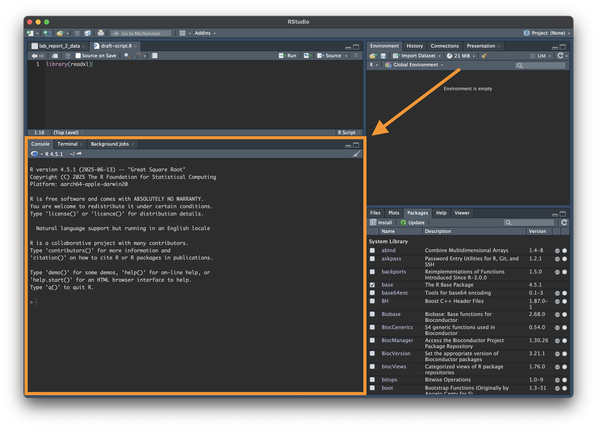
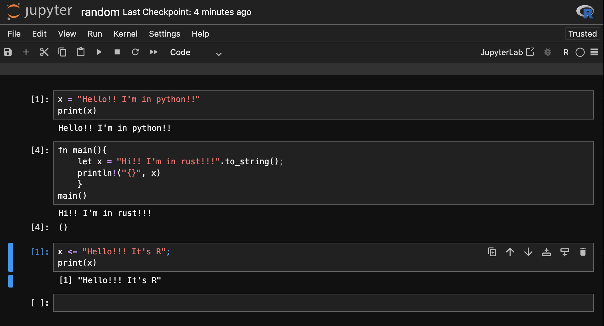
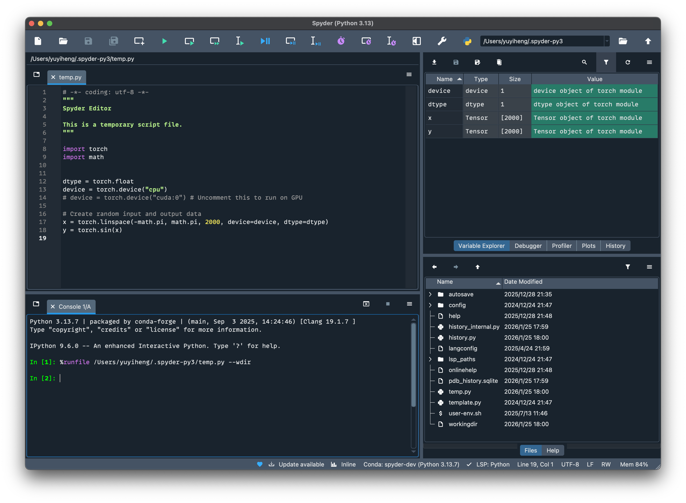
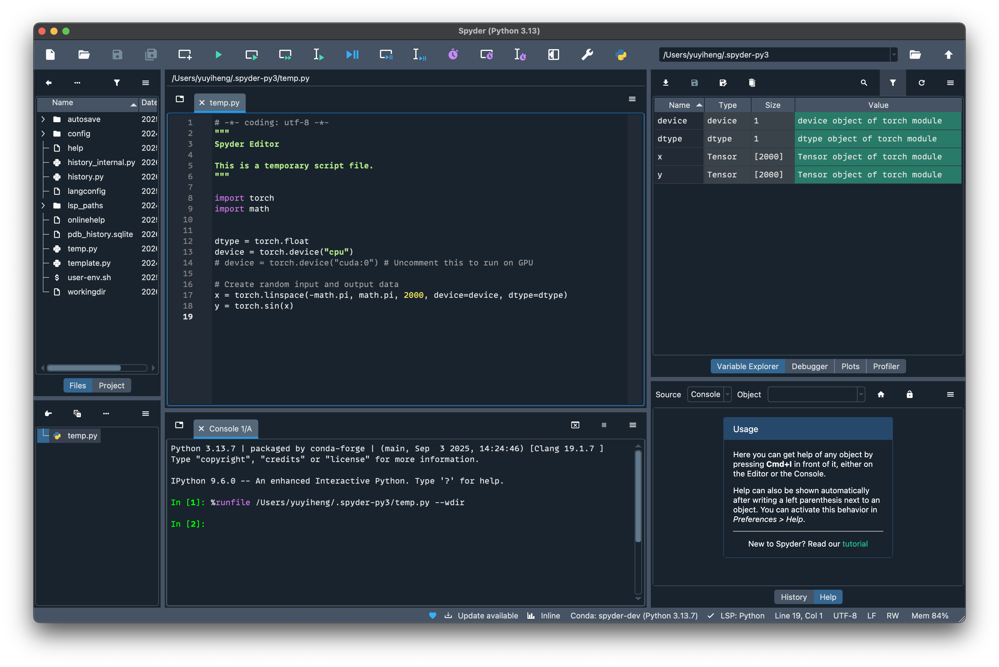

## Why Python?

I found the hardest part of learning python is learning *how to learn* python, or learning how to learn programming in general. Yes, both R and Matlab are very heavy on the side of programming, however, both of these two languages hides a lot of computer science stuff out of your sight. As a result, any other more programming languages could feel very intimating at the start. Python is one of these more generalised programming language.

***

### Compared with R

Generally, compared with R:

- Python is much easier to share things with people without much data background.
- It's much easier for other people to replicate your results with python.
- Python feels much easier when it comes to working with EXCEL/ csv.
- Python is *extremely* handy for any web-related tasks, like uploading/ downloading data from the server, running scritps on server, etc.
- Python has multiple of very mature library for building/ running/ managing/ accessing/ modifying neural network models and neural network related pipelines.
- **Also**, Python has pretty good support for running/ managing R scripts.

")

In general, I found python being an excellent *medium* bridging the rich math and stats libraries of R and the daily ins and outs of R tasks.

***

### Tips on learning

**1. You need to start with a project**

My number 1 barrier is the lack of motivation of doing so. Why would I bother learning a completely new thing whilst I can do the same task with existing tool? Yes python *might* provide solutions to *some* of my frustraction, it might help me handling things easier, but I can live happily as is.

Sometimes I would come accross some papers/ new models written in Python, these would be times that I really wish I know a bit more of it. Yet, the fact that I need to learn an entire programming language so that I could access some *models* from a paper is...not very cost-effective when it comes to time and effort.

I found there are a lot of things that comes *extremely* handy with python, but the benefit **only comes after** I gained enough knowledge about it. Python allows you to do A LOT of things, but I found the best way of learning how to do it is not following some text books, it's learning how to do things that you want to do, but in python. 

***

**2. No such thing as 'Too hard for a beginner'**

There is no project that's too hard for a beginner. The only difference is the amout of learning required might be different for a more experienced person. You want to write an entire program for your computer with python? Yes it might very hard if you don't know anything, but it's not impossible. You'd need to learn a lot of things, of course. You will came accross many obstacles and many of them can be extremely discouraging. There will be many error messages and most of the time your code won't work. That's all part of learning.

But, THE most important, the quickest, and the only way of learning, is **writing your own code**.

***

**3. Your first code will be horrible**

The only way to learn a language is to write your own version. Not just copying down the tutorial, you need to write your **own** version of the code. Or, a good alternative would be copying someone elses examples, and **modifying** it so that it suits your purpose.

It's very normal to go back to your old codes and re-write sections and sections of it because you've learned better way ot doing it. It's an *extremely* common thing even for very matured, well-maintained commercial packages, even.

***

**4. All errors are human error**

The first lesson I've learned from my supervisor is that, machine never makes mistake, all errors are human error. Computer would only do things human tells it to do. It would never 'randomly' do things on its own. 

Unexpected things happens. But these things happens because *human* made mistakes. You can trust your computer and you can trust it do exactly what you tell it to do. You won't break things 'accidently', unless you *explicitly* tells it to break things.

More over, You won't brick you machine from tying things out. Even if you do, most of the time, there are always ways of recovering your lost progress.

***

## Basics

### It feels more like an app

Just like simply having R-studio isn't enough, you need to install R in order to run R scripts, you also need to install python in order to run python scripts. In this sense, Python is more like an application than programming language. Just like you need to first install R in order to run R scripts, you need to first install python to run python scripts. 

The good news is, if you were using Mac/ Linux, your computer probably already have python installed as part of the operation system. If you were unfortunately a Windows user, the easiest way is to [download from the Microsoft Store](https://apps.microsoft.com/detail/9pnrbtzxmb4z), or from [the official website](https://www.python.org/downloads/).

***

### Running: the python console

To run python, you can simply open termial and type ```python```, followed by 'enter' key:

```fish
❯ python                                                                                                  (base)
Python 3.13.9 | packaged by Anaconda, Inc. | (main, Oct 21 2025, 19:11:29) [Clang 20.1.8 ] on darwin
Type "help", "copyright", "credits" or "license" for more information.
>>>
```

This is equivalent of the 'console' at the bottom in R-Studio/ Matlab:



> To exit, simply close terminal window, the same way as closing any other applications on your computer.

***

### Running: pre-written scripts

Or, you can write a script and open it with python to run it.

First, open your terminal and type:

For Mac/ Linux:

```sh
open .
```

For windows:

```cmd
start .
```

This will open the file exporer to the folder that's currently in.

Create a new .txt file in that folder, copy these texts into the txt file:

```text
print("Hello!")
```

Save this file as 'script.txt'.

Go back to terminal, and you can open this file with python by:

```fish
python script.txt
```

And you should see the result:

```fish
Hello!
```

***

## Setting things up

### Environment manager

You need to have a manager to help you switch different versions, like the version selector in Minecraft Launcher. This is because there are so many versions and the difference between different versions may vary quite a bit. When it comes to breaking changes between versions, Python itself is not as radical as Minecraft, but third-party packages could.

Environment control can be a pretty nasty discussion for it's own. As for now, think of it like file system: just like your computer has different folders for different things, you need to have different 'environment' for running different python projects. 

")

Just like you can have many folders arranging in however ways you like, you can have many different 'environments' in however ways you want. Each folder is independent from one another: file stored under folder A won't sneak into folder B. Things you do in environment A won't affect things you do in environment B.

There are a lot of python version managers out there: the official ```venv``` that comes with offcial python apps, the fast and modern ```uv```, and ```conda``` which I would like to recommend to you.

***

### Install environment manager

To install, conda comes with 2 versions: ***Anaconda*** that works and feels like an actual app, and ***Miniconda*** that can only be accessed through terminal. I ***do not*** recommend Anaconda, it's slow, clunky and just overall very painfull to use. Miniconda comes with everything you need, without the hassle and the head-scartching pain of waiting for things to load.

Here's the official link for installing Miniconda:

- [For Windows users](https://www.anaconda.com/docs/getting-started/miniconda/install#windows-installation)
- [For Mac and Linux](https://www.anaconda.com/docs/getting-started/miniconda/install#macos-linux-installation)

Follow the installation instruction to install Miniconda, then go to the 'Verify your install' section for your operating system ([Windows](https://www.anaconda.com/docs/getting-started/miniconda/install#windows), [Mac](https://www.anaconda.com/docs/getting-started/miniconda/install#macos), [Linux](https://www.anaconda.com/docs/getting-started/miniconda/install#linux)) to check if conda was correctly installed.

***

## Popular Tools

There are a lot of different R Studio equivalents for python. These are called 'IDE's.

Just like you don't need RStudio to write and run R, you also don't need IDE to write and run Python, but they are extremely handy when it comes to script development.

There are several common ones which I am going list out in this section, and will talk out my current set up in the next section.

***

### Pycharm


[Pycharm](https://www.jetbrains.com/pycharm/) is probably one of the mostly used IDE out there. My personal experience with pycharm isn't very great.

**Pros**
- It is very rigrous, it checkes for a lot of errors as well as your bad habits of code annotation. It make sure you are doing the right thing and you are documenting it in the right way.
- It *teaches* you write things in a highly reproducible manner.

**Cons**
- Its powerfullness comes with cost of being very low and clunky.
- From a personal experience, if you were doing web deveopment, writing an app etc., I can see the appeal of pycharm. However, a lots of these functions aren't really up for a data scientist. Its rigourness helps software development, but is a huge downside if I just want something that works very quickly.

***

### Jupyter Notebook


[Jupyter](https://jupyter.org/try) notebook is the go-to for any data science related tasks. It is basically R-Markdown but for python. Instead of an IDE, by default, it writes and runs in a web browser ([try it out here](https://jupyter.org/try-jupyter/notebooks/?path=notebooks/Intro.ipynb)). Jupyter notebook is also part of the ***conda*** ecosystem. You REALLY want to install conda in order to work with jupyter notebooks.

There are many notebook varients that feels more or less the same from an user perspective, like [google colab](https://colab.research.google.com/).

**Pros**
- Notebook is probably the best go-to for any exploratory data related tasks. It's *extremely* handy for writing snippets of one-off scripts that you *may* come back later, or things that you *may* need a quick refrerence in the future.
- Also, just like R-Markdown, the good thing about jupyter notebook is that it's very easy to share scripts with other data scientists. They can read your code, know excatly what you did with your data, and able to replicate your result with ease.
- In addition, you can directly export your notebook into html and positing on the internet. All of my posts on [transformers](https://yuyiheng.cc/topics/transformers/) are initially drafted using Jupyter Notebook.
- Moreover, Jupyter notebook supports **multiple languages**. You can have both Python and R in the same notebook with some minimum setups, as shown in the screenshot here:


**Cons**
- The downside is, you need to do A LOT of adjustments and customisations initialy in order to make it suitable for your needs. If you've been writing with raw R or Matlab ('.r' and '.m' files, instead of '.rmd' files), you may find learning jupyter notebook quite painful. You need to know a little bit of local host, a bit html, and a lot of python ins and outs.
- Just like R markdown, jupyter notebook is *solely* is *solely* a notebook for taking records of snippts of codes and ideas. It is *not* a tool for writing packages, libraries, applications etc. In the past, I did tried and tested a lot of different ways of creating some sort of workflows/ scripts using notebook, but result in varying degrees of success, most of them falling on the unsuccessfull side.

***

### VS Code


As of December, 2025, VS Code is currently considered to be the [most used IDEs for programming](https://stackoverflow.co/company/press/archive/stack-overflow-2025-developer-survey/), *me included*. VS Code itself is just an text editor like notepad that does not comes with anything extra, but users can install all sorts of extensions that suits their needs, [python](https://marketplace.visualstudio.com/items?itemName=ms-python.python), [R included](https://marketplace.visualstudio.com/items?itemName=REditorSupport.r).

**Pros**
- There is an extension for almost anything, [including jupyter notebook](https://marketplace.visualstudio.com/items?itemName=ms-toolsai.jupyter)
- [Themes](https://vscodethemes.com/)!
- It's an extremly flexible tool, you can tune it however you like, making it work in ways that you find comfortable. It natually works with multiple programing langauges.

**Cons**
- It's an extremely flexible tool, you can tune it however you like, thus, you will have a lot of things to learn beforehand. You will need to learn [JSON](https://code.visualstudio.com/docs/languages/json), the concept of [workspace](https://code.visualstudio.com/docs/configure/settings), configurate your [debugger](https://code.visualstudio.com/docs/debugtest/debugging-configuration), etc. There is a HUGE learning curve if you don't come from a programming background, and learning all these at once can be a bit overwhelming.
- I use VS Code mainly as a debugger, for chaing/ modifying python modules that I've been developing in the past. These modules contain lots of sub-modules, with each of them doing it's own thing whilst taking with some other sub-modules. I usually need to go into part of my old code, changing a bit of the code, adding some new functiontionality to it, or modifhying packages downloaded from somwhere else. VS Code is the excellent tool for this particular task.

***

## My Recommendation

### Spyder and its ceveats
All the tools listed above shares the same downside: there's a lot of programming basics you'd need to catch up even before starting to learn python. If only there exists tools that *works* and *feels* very similar to our beloved matlab and r-studio..

And there *is* such tool: [spyder](https://www.spyder-ide.org/), but it comes with **a lot of ceveats**, which I will list them out later. But first, this is how it looks like:



You also can change it to Matlab layout too:



In addition to the ease of use, here are list of things that I found really good about spyder:
- Variable explorer where you can double click to view variables, which is **extremely** helpful for whoever starts learning python
- Console that works in the same way as R & matlab
- Very handy plotting tool, inline plotting is a life saver
- Unlike jupyter notebook, you can develop local packages with it.

However, it also comes with it's own share of problems:
- It's an open-source, community-based project, and as a result there are all sorts of bugs here and there. Most of them are tolerable. For example, Due to the way it works, the spyder console doesn't handle termianl async very well. Bugs like this are relatively easy to spot out and by the time you encounter them, you should already gained enough knowledge on how to handle them.
- Spyder does not work with GUI building tools like [```tkinter```](https://docs.python.org/3/library/tkinter.html) or [```PyQt```](https://pypi.org/project/PyQt6/). These are packages for writing applications with graphical user interface.
- Although it do support [notebook](https://docs.spyder-ide.org/current/plugins/notebook.html), I found using notebooks in spyder overall very painful. It's slow, inresponsive, and frustrating.
- Spyder does not have much support for non-python language.

However, all issues spyder has are not very much of concern when it comes to data science. Because of this, I would like to think Spyder as the perfect gateway tool for any data scientist/ R or Matlab user who wants to learn python. One can safely build their first project with spyder, learn the basic in and outs with familiar user interface, and slowly migrate to other tools once the know much better about what they should be looking for.

***

**Notes on install Spyder**

I DO NOT recommend download and use spyder through the offcial way (i.e., download the spyder.exe/ spyder.dmg and double click to install), because it skips a lot of very important environment setups, and re-configuring them can be a very big headache. Go to [conda-based distribution section](https://docs.spyder-ide.org/current/installation.html#conda-based-distributions) of their installation guide, and follow the instructions for setting up a conda environment, and then install spyder in the dedicated environment. It's not very hard, but it require you install conda first, as instructed [previously](#install-environment-manager).

**My current set up**
Now adays, I tend to use VS Code and Spyder interchangablely depending on the nature of my task:

I mainly use VS Code for:
- Jupyter Notebook
- Developing/ modifying existing python packages
- Reading source codes, mostly for figuring out the implementation details or modyfing them.
- Multi-language developments. For example, writing this website.

And I mainly use Spyder for:
- Testing out new ideas
- Writing throwaway scripts
- Doing exploratory data works
- An superme replacement for Microsoft Excel. Why would I write those unreadable, unmaintainable excel formula when I can do exactly the same task but with much lesser headache in Python...

***

## Useful Resources

Some useful learning resources:

- Real Python's article on each topic of interest, for example, [this article on if/else/for in python](https://realpython.com/python-control-flow/) article. I found it much easier to type 'things i want to learn' plus 'site:realpython.com' in search engine than navigating through their website.

- [Stack overflow](https://stackoverflow.com/) for being the best resource out there when one needs to find help.